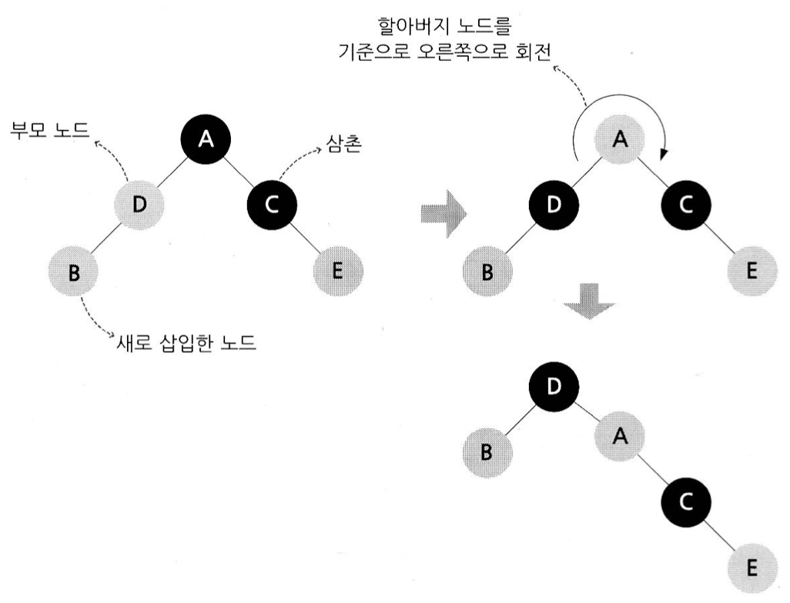

# containers
+ C++ STL의 컨테이너들을 직접 구현하며 학습한 내용

## Template Meta Programming (TMP)
+ 템플릿을 사용하면 객체를 생성하지 않더라도 타입에 대한 어떠한 값을 부여할 수 있고, 또 그타입을 가지고 연산을 할 수가 있다.

## Allocator
+ 메모리 관리를 좀 더 세밀하게 컨트롤하고 유연하고 효율적으로 사용해야할 때 (주로 라이브러리를 작성할 때, 특히 표준 라이브러리의 컨테이너를 구현할 때) 많이 사용된다.
+ new 연산자는 값의 초기화를 진행하기 때문에 초기화되지 않은 공간으로 메모리 할당을 하는 Allocator에 비해 자원 소모량이 크다.
+ 주로 다음 4개의 멤버함수와 비멤버 함수를 사용한다.
	```cpp
	template <class T>
	class allocator
	{
	public:
	T* allocate(size_t);
	void deallocate(T*, size_t);
	void construct(T*, const T&);
	void destory(T*);
	
	....
	};

	template <class In, class For>
	For uninitialized_copy(In, In, For);

	template <class For, class T>
	void uninitialized_fill(For, For, const T&);
	```
	+ T* allocate(size_t);
		+ 초기화되지 않은 메모리를 할당하고 그 시작 주소를 반환하는 함수
		+ 매개변수는 T객체의 개수이다.
		+ 할당될 크기 + 4바이트만큼 할당하여 여유있게 공간을 할당한다.
	+ void deallocate(T*, size_t);
		+ 인자로 할당한 메모리의 시작 주소를 가리키는 포인터와 T객체의 개수를 받는다.
	+ void construct(T*, const T&);
		+ 포인터가 가리키는 위치(초기화되지 않은 공간)에 객체를 저장하는 함수
	+ void destory(T*);
		+ 객체를 소멸시킨다. (객체의 소멸자를 호출시킨다)
	+ template \<class In, class For\> For uninitialized_copy(In, In, For);
		+ std::copy함수와 비슷하다.
		+ 입력 반복자2개 (first, last)와 순방향 반복자 1개(out)을 인자로 받는다.
		+ first, last 범위의 요소들을 out이 가리키는 위치에 순서대로 복사한다.
		+ 복사가 완료된 위치의 다음요소를 가리키는 포인터를 반환한다.
	+ template \<class For, class T\> void uninitialized_fill(For, For, const T&);
		+ 세번째 인자로 들어온 값으로 주어진 범위의 공간을 채운다.

+ rebind
	```cpp
	template<typename T>
	class StlCustomAllocator : public allocator<T>
	{
		// ... (상략)
	
		template<typename _Other>
		struct rebind
		{
			typedef StlCustomAllocator<_Other> other;
		};
	
		// ... (하략)
	};
	```
	+ 위 예시에서 list의 경우 실제로 사용되는 allocator는 다음과 같이 될 것이다. StlCustomAllocator::rebind<_Node>::other
	+ rebind 는 어떤 종류의 객체를 얻기 위해 사용된다. std::list와 A라는 타입을 예로들면, std::list<T,A> 할당자는 T를 할당하기 위한 A이지만, 실제로 내부에서 list는 노드 기반으로 가지고 있어야 한다.이렇게 T타입이 아닌, 다른 타입으로도의 할당( node )이 필요해지게 되는데 이와 같은 요구사항을 충족하기 위해 rebind 를 가져야 할 것을 권고 하고 있다. (이는 C++17에서 사용중지 권고가 내려졌고, C++20에서 삭제 예정이다.)

## Iterator
### Iterator 종류별 사용가능한 기능
+ Input Iterator(입력 반복자): 읽기(rvalue, Write 불가능), 비교 (==, !=), 증감연산은 ++만 가능
+ Output Iterator(출력 반복자): 쓰기(lvalue, Read 불가능), 비교 (==, !=), 증감연산은 ++만 가능
+ Forward Iterator(순방향 반복자): Input / Output Iterator의 모든 기능
+ Bidirectional Iterator(양방향 반복자): 읽기, 쓰기, 산술 연산(++, --), 비교 연산(==, !=)
	+ list, set, map이 이 반복자를 지원한다.
	+ reverse()함수가 이 양방향 반복자를 사용하기 때문에 양방향 반복자를 지원하지 않는 컨테이너는 reverse()함수를 사용할 수 없다.
+ Random Access Iterator(임의 접근 반복자): 읽기, 쓰기, 산술 연산(++, --, +, -, +=, -=), 비교 연산(==, !=, >, <, >=, <=), 첨자 연산([])
	+ vector, deque가 이 반복자를 지원한다.

### iterator_traits
+ traits(특성정보) 클래스는 컴파일 도중에 어떤 주어진 타입의 정보를 얻을 수 있게 하는 객체를 지칭하는 개념이다.
+ C++ 프로그래머들이 관용적으로 사용하는 기법으로 C++에 정의된 문법구조나 키워드는 아니다.
+ 관례적으로 아래와 같은 항목들을 충족해야 한다.
	+ 일반적으로 특성정보는 구조체로 구현하나, 이를 특성정보(traits) 클래스라 부른다.
	+ 특성정보는 기본제공 타입에 대해서 쓸 수 있어야 한다.
+ traits를 활용하여 컴파일 도중에 인자로 넘어온 iterator에 맞는 함수를 실행할 수 있다.
+ iterator_traits\<T*\>:포인터는 산술 연산이 가능하므로 random_access_iterator_tag를 지정해준다.

## SFINAE(Substitution Failure Is Not An Error: 치환 실패는 오류가 아니다)
+ 템플릿 인자 치환에 실패할 경우 컴파일러는 이 오류를 무시하고, 그냥 오버로딩 후보에서 제외하면 된다.
	```cpp
	template <typename T>
	void negate(const T& t) {
		typename T::value_type n = -t();
	}
	```
+ 위의 경우 함수내부의 T::value_type 때문에 컴파일 오류가 발생한다.
	```cpp
	template <typename T>
	void negate(const T& t, typename T::value_type n = -t()) { }
	```
+ 컴파일 오류를 발생시키지 않기 위해서는 함수의 선언부에 타입 치환 오류를 발생시켜서 오버로딩 후보군에서 제외시켜야 한다.
	### enable_if
	+ SFINAE를 잘 활용하는 툴들 중 가장 널리 쓰이는 것이 enable_if이다.
		```cpp
		// enalbe_if의 정의
		template <bool B, typename T = void>
		struct enable_if {};

		template <typename T>
		struct enable_if<true, T> {
			typedef T type;
		};
		```

## vector
+ 멤버함수
	+ iterator 반환 함수
		+ begin() : 시작 이터레이터 반환
		+ end() : 끝 이터레이터 반환
		+ rbegin() : 시작 reverse 이터레이터 반환 (끝 이터레이터)
		+ rend() : 끝 reverse 이터레이터 반환 (시작 이터레이터)
	+ size() : 원소의 개수 반환
	+ max_size() : 최대 원소 개수 반환
	+ resize(size_type n, value_type val = value_type()) : 벡터의 사이즈를 n개로 변경한다. n이 현재 사이즈보다 클경우 사이즈를 증가시키고 val로 채운다.
	+ capacity() : 현재 할당된 공간에 넣을 수 있는 원소의 개수를 반환
	+ empty() : 벡터가 비어있으면 1, 아니면 0 반환
	+ reserve() : capacity를 변경한다. 현재 capacity보다 작은 값이 들어오면 아무런 동작도 하지않는다.
	+ assign
		+ template \<class InputIterator\> void assign(InputIterator first, InputIterator last) : 원래 벡터의 내용들을 지우고 first 부터 last 바로 직전까지의 원소들을 벡터에 채운다.
		+ void assign(size_type n, const T& u) : 원래 벡터의 내용들을 지우고 원소 u를 n개 채운다.
	+ push_back(const value_type &val) : 맨 끝에 원소를 삽입한다.
	+ pop_back() : 맨 끝 원소를 제거한다.
	+ insert
		+ iterator insert(iterator position, const value_type &val) : position 앞에 val을 삽입한다. 삽입된 val의 위치를 반환한다.
		+ void insert(iterator position, size_type n, const value_type &val) : position 앞에 n개 만큼 val을 삽입한다.
		+ template <typename InputIterator> void insert(iterator position, InputIterator first, InputIterator last) : position 앞에 first 부터 last까지 삽입한다.
	+ erase
		+ iterator erase(iterator position) : position위치의 원소를 삭제한다.
		+ iterator erase(iterator first, iterator last) : first부터 last 직전까지의 원소를 삭제한다.

## algorithm
+ equal
	+ 두 범위의 요소가 같은지 검사하는 함수

+ lexicographical_compare
	+ 사전식 순서로 비교해주는 함수
	+ first1, last1이 first2, last2보다 사전순으로 작을 경우 true를 반환한다.

## map
+ Red-Black Tree를 사용하여 내부에 Key와 Value형태로 이루어진 데이터를 저장한다.
+ 기능
	+ empty
		+ 컨테이너가 비어있는지 확인하여 비어있으면 1, 아니면 0 반환
	+ size
		+ 컨테이너에 들어있는 원소의 개수 반환
	+ max_size
		+ 최대 size를 반환
	+ insert
		+ 원소를 삽입
	+ erase
		+ 해당 원소를 제거
	+ swap
		+ map과 map각각의 내부의 데이터를 서로 바꾼다.
	+ clear
		+ 모든 데이터를 지운다.
	+ key_comp
		+ 키를 비교하는 비교 함수를 반환한다.
	+ value_comp
		+ value_type의 key를 비교하는 비교함수를 반환한다.
	+ find
		+ 입력받은 원소를 찾아 이터레이터를 반환한다.
	+ count
		+ 키를 입력받아 해당 키를 가진 원소의 개수를 반환한다. (같은 키로 여러개의 값을 가질 수 없으므로 1 또는 0이 반환된다.)
	+ lower_bound
		+ 입력받은 키보다 작지 않은 첫 원소의 이터레이터를 반환한다. (같은 값 포함)
	+ upper_bound
		+ 입력받은 키보다 큰 첫 원소의 이터레이터를 반환한다.
	+ equal_range
		+ 키를 입력받아 first로 lower_bound, second로 upper_bound를 가진 pair를 반환한다.
	+ get_allocator
		+ allocator를 반환한다.


### Red-Black Tree
+ 일반적인 이진트리의 경우, 한쪽에만 자식이 많이 생겨 균형 있지 못하게 자라날 수 있다.
+ Red-Black Tree의 경우 균형을 잡아줌으로써 일정한 실행 시간을 보장해줄 수 있다. 
+ 5가지 조건을 만족하는 이진 트리를 Red-Black트리라고 부른다.
	1. 각 노드의 색은 red 또는 black이다.
	2. root 노드는 black이다.
	3. 모든 말단노드(leaf node)는 블랙이다. (NIL이 black이다.)
		+ NIL node: 자식 노드가 존재하지 않는 노드는 NIL node이다. 따라서 모든 leaf node는 NIL node이다.
	4. red 노드의 자식노드들은 전부 black이다.(red 노드는 연속해서 등장할 수 없다.)
	5. Root 노드에서 시작해서 자손인 leaf노드에 이르는 모든 경로에는 동일한 개수의 black노드가 존재한다.
	+ 

+ 기본 연산
	+ 회전
		+ 부모-자식의 위치를 서로 바꾸는 연산이다.
		+ 
		+ 우회전을 할 때에는 왼쪽 자식 노드의 오른쪽 자식 노드를 부모 노드의 왼쪽 자식으로 연결한다.
		+ 좌회전을 할 때에는 오른쪽 자식 노드의 왼쪽 자식 노드를 부모 노드의 오른쪽 자식으로 연결한다.
		+ 시간복잡도: O(1)
	+ 삽입
		+ 이진 탐색을 통해 삽입할 장소를 찾고, 새 노드를 빨간색으로 칠한 후 양쪽 자식에 NIL노드를 연결시킨다. 이후 노드 삽입 때문에 무너졌을지도 모르는 규칙들을 살펴봐야 한다.
		+ 이 시점에서 1, 3, 5번 규칙은 절대로 위배되지 않는다. 위반될 수 있는 규칙은 2, 4번인데 2번 "root 노드는 black이다."규칙은 루트 노드를 무조건 검은색으로 칠하면 되기 때문에 간단하다.
			+ 그렇다면 남아있는 위반될 수 있는 규칙은 4번 "red 노드의 자식노드들은 전부 black이다."규칙이다. 이 규칙이 위반 되었다면 삽입한 노드와 부모 노드의 색이 모두 빨간색이라는 것을 의미한다.
				+ 부모 노드가 할아버지 노드의 왼쪽 자식일 때, 위 규칙을 위반하는 경우는 다음 세가지 경우이다.
					1. 삼촌도 빨간색인 경우
						+ 부모 노드와 삼촌 노드를 검은색으로 칠하고, 할아버지 노드를 빨간색으로 칠하면 된다.
						+ 
						+ 할아버지 노드를 빨간색으로 칠함으로써 4번 규칙이 다시 위협받을 수 있다. 그래서 할아버지 노드를 새로 삽입한 노드로 간주하고 다시 처음부터 4번 규칙을 위반하는 세가지 경우를 따져봐야 한다. 부모 노드가 검은색이거나 새로 삽입한(또는 새로 삽입한 것으로 간주한)노드가 루트일 때까지 반복한다.
					2. 삼촌이 검은색이며 새로 삽입한 노드가 부모 노드의 오른쪽 자식인 경우
						+ 부모 노드를 왼쪽으로 회전시켜 이 상황을 세번째 경우의 문제로 바꾼다.
						+ 
						+ 첫 번째 경우를 처리한 다음에 할아버지 노드를 새로 삽입한 노드로 간주했던 것처럼, 이번에는 부모였던 노드를 새로 삽입한 노드로 간주시키고 세 번째 경우의 문제로 현재 상황을 넘긴다.
					3. 삼촌이 검은색이며 새로 삽입한 노드가 부모 노드의 왼쪽 자식인 경우
						+ 부모 노드를 검은색, 할아버지 노드를 빨간색으로 칠한 다음 할아버지 노드를 오른쪽으로 회전시킨다. 
						+ 
						+ 이 경우를 처리하고 난 다음에는 4번 규칙이 위반되지 않는다. 새로 삽입한 노드 B의 부모 D가 검은색이기 때문이다. D의 부모가 빨간색이어도 검은색이어도 여전히 4번 규칙이 위반되지 않는다.
				+ 부모 노드가 할아버지 노드의 오른쪽 자식일 때 (왼쪽 자식일때의 반대)
					1. 삼촌도 빨간색인 경우
						+ 부모 노드와 삼촌 노드를 검은색으로 칠하고, 할아버지 노드를 빨간색으로 칠하면 된다.
					2. 삼촌이 검은색이며 새로 삽입한 노드가 부모 노드의 왼쪽 자식인 경우
						+ 부모 노드를 오른쪽으로 회전시켜 이 상황을 세번째 경우의 문제로 바꾼다.
					3. 삼촌이 검은색이며 새로 삽입한 노드가 부모 노드의 오른쪽 자식인 경우
						+ 부모 노드를 검은색, 할아버지 노드를 빨간색으로 칠한 다음 할아버지 노드를 왼쪽으로 회전시킨다. 
		+ 시간복잡도: O(logN)
	+ 삭제
		+ 빨간색 노드를 삭제하는 경우에는 추가적인 뒷처리를 할 필요가 없다.
		+ 검은색 노드를 삭제하는 경우에는 5번 규칙이 위배된다.
			+ 삭제한 노드의 부모와 자식이 모두 빨간색인 경우 4번 규칙도 위배된다.
				+ 
				+ 삭제된 노드를 대체하는 노드를 검은색으로 칠하면 4번, 5번 규칙을 한번에 보완 가능하다.
			+ 삭제한 노드의 부모 노드가 빨간색이고 자식이 검은색인 경우에는 5번 규칙만 위배된다. 
				+ 
				+ 삭제된 노드를 대체하는 노드를 검은색으로 칠해 검은색을 2개 가지는 '이중흑색'노드로 만든다.
				+ '이중흑색'노드를 만듬으로써 5번 규칙을 보완하고 1번 규칙이 무너지게 된다.
					+ '이중흑색'노드 처리 (부모 노드의 왼쪽 자식인 경우)
						1. 형제가 빨간색인 경우
							+ 형제를 검은색, 부모를 빨간색으로 칠한다. 그 후 부모를 기준으로 좌회전한다. 이렇게 해서 형제가 검은색인 경우로 넘겨준다.
							+ 
						2. 형제가 검은색인 경우
							+ 2-A. 형제의 양쪽 자식이 모두 검은색인 경우
								+ 형제 노드만 빨간색으로 칠한 다음, 이중흑색 노드가 갖고 있던 두개의 검은색 중 하나를 부모 노드에게 넘겨준다. 부모 노드도 부모 노드의 형제의 상황에 따라 대처한다.
								+ 
							+ 2-B. 형제의 왼쪽 자식은 빨간색, 오른쪽 자식은 검은색인 경우
								+ 형제 노드를 빨간색으로 칠하고 왼쪽 자식을 검은색으로 칠한 다음, 형제 노드를 기준으로 우회전한다.
								+ 
							+ 2-C. 형제의 오른쪽 자식이 빨간색인 경우
								+ 이중흑색 노드의 부모 노드가 갖고 있는 색을 형제 노드에 칠한다. 그 다음 부모 노드와 형제 노드의 오른쪽 자식 노드를 검은색으로 칠하고 부모 노드를 기준으로 좌회전하면 1번 규칙이 복원된다.
								+ 
		+ 시간복잡도: O(logN)

## 기타

### operator->() 를 오버로딩할 때 일어나는 현상 및 주의점
+ operator->() 를 오버로딩하고 화살표 연산자(arrow operator)에 의해 operator->() 가 호출될 경우 자동적으로 -> 가 한 번 더 적용된다.
	+ 다음과 같은 경우 A->A->A->... 로 무한 재귀에 빠져버린다. 그러므로 operator->()를 오버로딩할 때에는 함수가 호출된 클래스 자신을 반환해서는 안 된다. 
	```cpp
	struct A
	{
		A operator->()
		{
			return *this;
		}
	};
	```

### 연산자 오버로딩 시 교환법칙이 성립하도록 만들기
+ 클래스 내부에서 멤버함수로 연산자를 오버로딩할 경우 Class + int 는 가능하지만 int + Class는 불가능하다.
	```cpp
		template <typename T1, typename T2>
		bool operator==(const random_access_iterator<T1> &lhs, const random_access_iterator<T2> &rhs)
		{
			return lhs._ptr == rhs._ptr;
		}
	```
	+ 위와 같이 비멤버함수로 오버로딩하면 교환법칙이 성립할 수 있다.

### std::